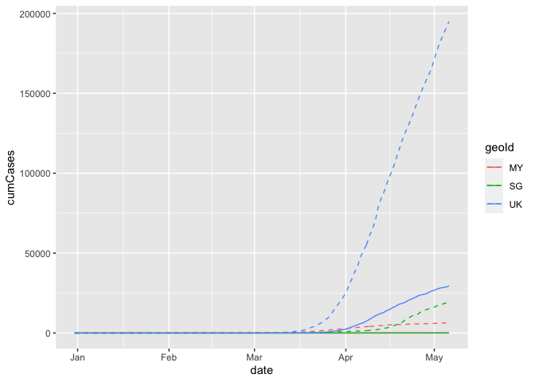

## Latest figures

This tracker pulls together the latest COVID-19 data focusing on Malaysia and some comparison countries.

### COVID-19 cases and deaths

The peak of cases and deaths seems to have been reached in many countries. 

<!-- -->

### Measures to contain the crisis

Many countries faced with the pandemic have implemented measures enforcing safe distancing between people, including "lockdowns," business closures etc. Understandably, these measures have a big economic impact. 

<!-- -->

Sources for these charts: 

