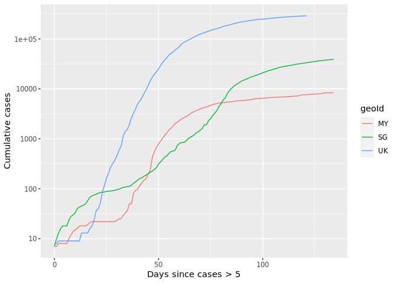
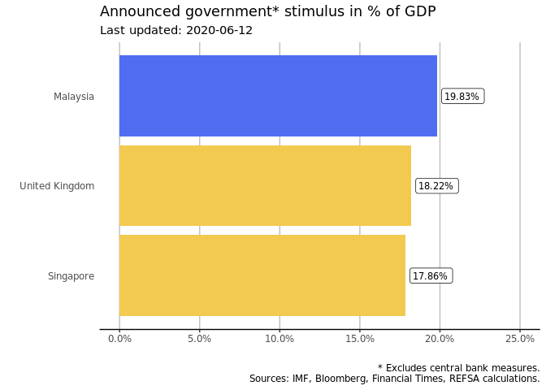
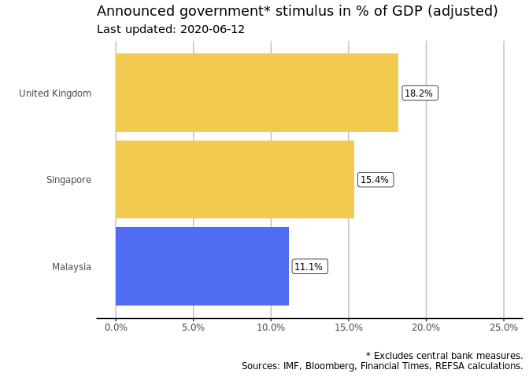
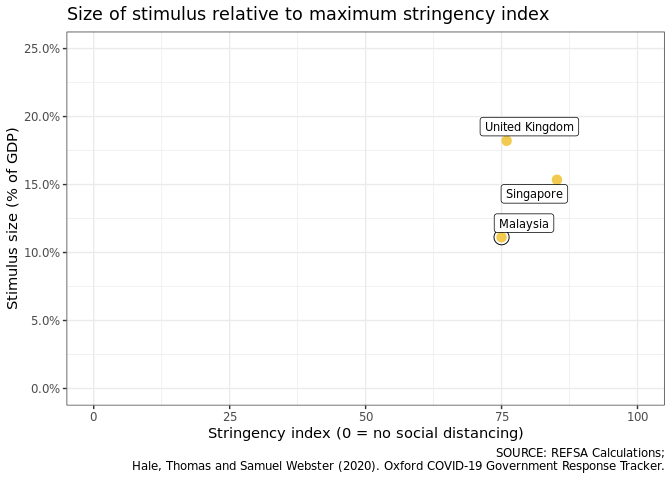

## Introduction

In early April, REFSA prepared a comparison of the COVID-19 related stimulus packages in Malaysia, Singapore and the United Kingdom. Because the overall situation is still evolving quickly, we have created this tracker, which shows the most up-to-date we have for each of the three countries.

We're tracking the most significant variables: 
 1. The spread of COVID-19 in each country, with the number of cases and deaths.
 2. The degree to which lockdown measures were observed in each country. The economic damage of COVID-19 is due to the restrictions imposed on movement, so where the measures were more drastic and observed better, we expect greated economic damage. 
 3. Stimulus measures announced by the three countries. Comparing measures is always difficult, so we take a fairly liberal view: any measure which results as the government bearing the ultimate cost counts as a stimulus measure (e.g. cash disbursements, subsidies, loan guarantees.)
 
These variables are logically connected, e.g. where the number of COVID-19 cases is high, movement control measures could be expected to be more stringent, hence the economic impact greater.

### COVID-19 Cases and Deaths

#### Cumulative cases and deaths by date, linear scale

<!-- -->

#### Cumulative cases per day since cumulative cases exceeded 5 (log scale)

<!-- -->

### Movement Control Measures

In order to slow the progression of the pandemic, each of the three countries in our comparison group have implemented some form of movement control measures, generally limiting people's movement, and by extension halting economic activity to a significant degree. 

We can infer that the economic impact is linked with the extent to which the movement control measures were followed (and enforced), as well as the length of time they were imposed for.

#### Routing requests

In order to chart this, we currently rely on data provided by Apple, which shows the evolution in the number of routing requests through its Maps app. In other words, this correlates to the amount of trips people make to places that may not be familiar to them. As a baseline, the statistic uses the 13th of January 2020 (base= 100). Subsequent days in the year are shown relative to this baseline. 

<!-- -->

These charts immediately show a few interesting trends: 

* Routing requests exhibit a weekly pattern, they are higher on weekends than during the week. This fits with the assumption that most people only require GPS routing assistance when driving to unknown places, which is more likely to happen during weekends. During the week movements are mostly limited to work and school commutes. 
* Singapore shows a marked drop in routing requests from late January onwards, even in the absence of any formal movement control order. In the initial stages, Singapore appeared to be worse affected than other countries in the region, and the government started recommending voluntary safe distancing measures. From the moment the Circuit Breaker went into effect, we see another drop in requests, as well as the disappearance of the weekly pattern. 
* Malaysia and the UK follow a similar pattern, with a steep drop in requests from the moment the movement control measures start. In the initial stages, the drop in requests in Malaysia was close to 70%. In Malaysia, the weekly pattern has also disappeared. 
* Another noteworthy feature in Malaysia, the large peak around the Chinese New Year week-end, where routing requests increased by 75%. This could indicate a large number of journeys to unknown areas, and in this context could be a contributor to rapid spread of the disease. This pattern could explain the stringent movement control enacted during the Hari Raya weekend. 

#### Stringency Index

Researchers at the University of Oxford have aggregated this kind of data, along with a series of qualitative factors, to come up with a "stringency index", that indicates how restrictive the movement control orders around the world were. Since this index is easy to compare, we rely on it for the rest of the analysis. A detailed description of the index is available on the website. 

<!-- -->
 
### Stimulus Measures

In order to mitigate the impact to the economy, each of the countries in the comparison group has announced stimulus measures. The bulk of these programmes were announced in March and April, and hence we refer to the detailed report REFSA prepared on each country's package: [Life Support for the Economy: A comparative analysis of Covid-19’s stimulus packages of Malaysia, Singapore and the United Kingdom](https://refsa.org/life-support-for-the-economy/).

Below, we summarise the headline numbers of the proposed stimulus measures, and their relative importance in terms of percentage of GDP. 

#### Comparison of nominal amounts

This chart compares the amount of stimulus as it was announced by the respective governments, in percentage of GDP. 

<!-- -->

#### Comparison of adjusted amounts

For this chart, we evaluated the headline measures and categorised them, in particular whether the eventual cost would accrue to the government, or to another party. In the case of Singapore and the United Kingdom, effectively all the monetary measures would be borne by the governemnt. Most of the stimulus package comes in the form of loan guarantees provided by the government. 

For Malaysia however, a substantial part of the package comes in the form of a loan moratorium provided by the banking sector, announced without any additional central bank support, and another portion is effectively an advance to contributors of the Employee Provident Fund. These two measures have been removed from the comparison below. 

<!-- -->

#### Stimulus size compared to stringency index

As mentioned higher, it stands to reason that more stringent movement control or safe distancing measures will have a bigger economic impact. Therefore it is interesting to consider whether governments have taken this into account in their stimulus plans. 

The chart below plots the size of the stimulus packages announced to date to the maximum stringency index since the beginning of the observations.

<!-- -->

### Latest changes

* 2020-06-02: Added measures announced in Singapore's "Fortitude" budget. 

### Data Sources

* Covid-19 cases and deaths: [European Centre for Disease Prevention and Control](https://www.ecdc.europa.eu/en/publications-data/download-todays-data-geographic-distribution-covid-19-cases-worldwide)
* Movement data: [Apple Covid-19 Mobility Trends Reports](https://www.apple.com/covid19/mobility)
* Stringency Index: Hale, Thomas, Sam Webster, Anna Petherick, Toby Phillips, and Beatriz Kira (2020). [Oxford COVID-19 Government Response Tracker](https://www.bsg.ox.ac.uk/research/research-projects/coronavirus-government-response-tracker), Blavatnik School of Government. Data use policy: Creative Commons Attribution CC BY standard.
* Stimulus Measures: REFSA compilation and calculations

